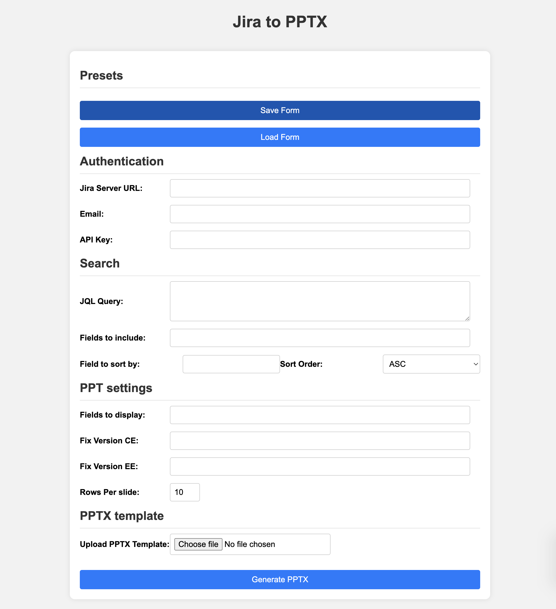

# Jira-2-PPTX

## Introduction
Jira-2-PPTX is a Python web application that enables users to query Jira through its API and convert the results into PPTX slides. This tool is especially useful for sharing details of specific releases with internal or external stakeholders, streamlining the process of report generation directly from Jira data.

## Features
- Easy conversion of JQL queries to PPTX slides.
- Save and Load presets for replicating search parameters and fields.
- Compatibility with custom-formatted PPTX templates.
- A blank template PPTX for starting point customization.

## Installation and Setup
### Jira-2-PPTX Docker Setup

Jira-2-PPTX simplifies its setup process through Docker, ensuring a hassle-free deployment. Here's how you can get it up and running:

### Local Building using Dockerfile and Docker-Compose:

- **Dockerfile and Compose File**: The repository includes a `Dockerfile-Jira2PPTX` and a `docker-compose.yml` file.
- **Building and Deployment**: Use these files to build the image locally and deploy the application with Docker.

### Using Pre-Built Image from Docker Hub:

- **Docker Hub Image**: For convenience, a pre-built image of Jira-2-PPTX is available on Docker Hub.
- **Image Tag**: You can find it under the tag `joshuacassin/jira2pptx`.
- **Ease of Use**: This simplifies the process, as you can pull the image directly without the need for local building.

### Nginx Integration:

- **Nginx in Docker**: Both the Docker-compose setup and the Docker Hub image employ an Nginx container.
- **Configuration File**: Ensure you have the `nginx.conf` file saved in your host directory at `/etc/nginx/`.
- **Importance**: This configuration is crucial for the proper functioning of the Nginx server with Jira-2-PPTX.

By following these steps, you can quickly set up Jira-2-PPTX using Docker, either by building it locally or by pulling the pre-built image from Docker Hub, along with setting up the necessary Nginx configuration.

## Usage
Jira-2-PPTX is ideal for stakeholders needing to share details of specific Jira releases. The tool facilitates the creation of presentation-ready slides directly from Jira data.

## Contributing
We welcome contributions to Jira-2-PPTX! If you're interested in helping improve the project, here's how you can get involved:
- **Submitting Pull Requests**: Follow the standard GitHub pull request process. Ensure your code is clean and well-documented.
- **Reporting Bugs/Issues**: Report any bugs or issues directly on the GitHub issues page.
- **Feature Suggestions**: Feel free to suggest new features or improvements by opening an issue on GitHub.

Contributors are encouraged to read our `CONTRIBUTING.md` file for detailed guidelines, which includes coding standards and processes for submitting contributions.

## Issue Tracking and Feature Requests
For now, all issue tracking and feature requests can be submitted through the GitHub issues page for this project. This process is intended to be straightforward and accessible, keeping the project open and community-driven.

## License
This project is licensed under the MIT License - see the [LICENSE](LICENSE) file for details.

## Contact
For any questions or if you'd like to contribute, please feel free to reach out through the GitHub repository.
